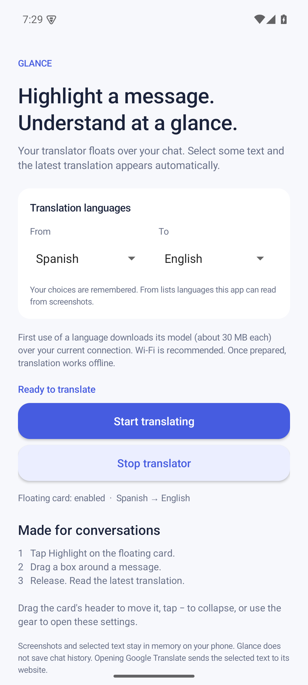
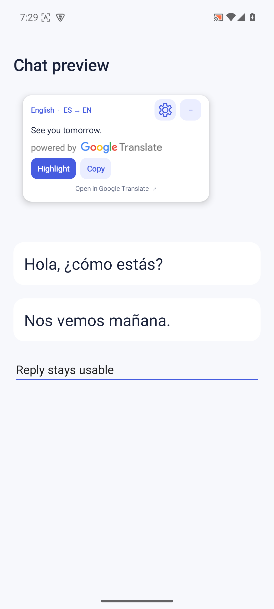

# Glance

**Highlight a message. Understand at a glance.**

Glance is a small floating screen translator for Android chats. Tap **Highlight**, draw a rectangle around a message, and release. The translation appears immediately in a movable card, replacing the previous result.

[Download the APK](https://github.com/499apps/glance/releases/latest) · [Report an issue](https://github.com/499apps/glance/issues) · [Contribute](CONTRIBUTING.md)

<p>
  
  
</p>

## Features

- Choose **From** and **To** languages before starting. Spanish → English is the default; choices are remembered.
- Translate the selected screen area automatically, without switching apps or tapping a confirmation button.
- Keep the latest result in a compact card: 13 sp text, small buttons, draggable header, and a collapse button.
- Tap the floating **gear** to open the main settings window. Apply another language pair without restarting screen capture.
- Copy a translation or open the recognized text in Google Translate with your selected languages.
- Recognize and translate on your phone after the required language models download. No account or API key.

## Install

1. Download `glance-1.1.0.apk` from [Releases](https://github.com/499apps/glance/releases/latest), open it on your phone, and allow installation from your browser or file manager if Android asks.
2. Open **Glance**, choose the source and target languages, and tap **Start translating**. First use downloads the selected translation models over your current connection (about 30 MB per language); Wi-Fi is recommended.
3. Enable **Display over other apps**, return to Glance, and allow Android's screen-capture request. Notifications provide a convenient Stop action.
4. Open a chat, tap **Highlight**, drag over a message, and release. Drag the card's title to move it; tap **−** to collapse or the language bubble to restore it.
5. Tap the gear for settings. Choose another pair and tap **Apply languages & return**. Stop from the app or notification.

Requires **Android 8.0 or later**. Updating an installed version ends its capture session; tap Start again. The package name remains `com.screentranslate.app`, so Glance updates the earlier Screen Translate app when signed with the same key.

Protected screens and apps that block capture or overlays cannot be translated. Android may end capture when the phone locks or another capture starts. Reopen Glance to begin a new session.

## Languages

The **From** menu offers languages supported by both our screenshot recognizers and the translation SDK. Recognition includes Latin, Chinese, Japanese, Korean, and Devanagari scripts. Spanish, English, French, German, Portuguese, Italian, Hindi, Marathi, Nepali, Chinese, Japanese, and Korean are among the available source languages.

The **To** menu offers all languages supported by the bundled Google ML Kit translation SDK. Languages whose scripts our recognizers cannot read, such as Arabic, can be translation targets but are excluded from the source menu. Selecting the same language on both sides provides recognized text without translation.

Translation quality varies with language, text size, slang, and context. Non-English language pairs use English as an intermediate language. See Google's [translation documentation](https://developers.google.com/ml-kit/language/translation) and [recognition language list](https://developers.google.com/ml-kit/vision/text-recognition/v2/languages).

## Privacy

Glance uses Google ML Kit for on-device recognition and translation. Screenshots, selected text, and the latest result stay in memory while the session runs. Glance does not save screenshots or chat history. It saves your language choices and the floating card's position.

Google's SDK downloads models and may send diagnostics under [Google's privacy policy](https://policies.google.com/privacy) and [ML Kit terms](https://developers.google.com/ml-kit/terms). Opening the optional Google Translate link sends the selected text to its website; Copy places the result in Android's clipboard.

Glance requests screen-capture consent, display-over-apps permission, notification permission, and internet access for model downloads. It does not request microphone, camera, accessibility, or storage access. Glance is an independent app and is not affiliated with Google.

## Build

Open the project in Android Studio with **JDK 17**, **Android SDK 35**, and **Build Tools 35.0.0**. Build a debug APK with:

```sh
./gradlew testDebugUnitTest lintDebug lintRelease assembleDebug
```

On Windows, the included scripts can download the official tools into the project's `.tools/` directory and build a locally signed release:

```powershell
./scripts/bootstrap.ps1
./scripts/build.ps1
```

The signed APK and SHA-256 checksum are written to `dist/`. The scripts verify tool download checksums and run unit tests and Android lint. Keep a private backup of `.signing/` to sign future updates with the same key. Signing files, downloaded tools, build output, and `local.properties` are excluded from Git.

On other systems, use Android Studio's **Generate Signed Bundle / APK** for your own release key. The GitHub workflow builds a debug APK for every pull request and main-branch push. Its release build is unsigned because private signing keys are not stored in this repository. Official signed APKs are available in Releases.

To install over USB, enable USB debugging and run:

```sh
adb -s YOUR_DEVICE_SERIAL install -r dist/glance-1.1.0.apk
```

## Test

```sh
./gradlew testDebugUnitTest lintDebug lintRelease
./gradlew connectedDebugAndroidTest
```

Use a disposable emulator or test phone for instrumentation tests. They grant overlay and notification permissions and display a debug-only sample chat; they do not use real conversations. A release installation must be removed from that test device before installing the debug APK because the signing keys differ.

The Windows helper also pulls test screenshots into the ignored `verification/` directory:

```powershell
./scripts/test-device.ps1 -Device emulator-5554
```

Tests cover selection coordinate mapping, valid language pairs and recognition routing, four additional script recognizers, automatic Spanish → English translation, replacement, moving and collapsing the card, typing into the underlying chat, cancellation, the settings gear, saved dropdown choices, changing to French → German during a capture session, and stopping the overlay.

Version 1.1.0 passed eight unit tests, debug and release lint, and both instrumentation tests on an Android 15 emulator. The signed release APK passed signature verification. Screenshots above show the debug sample chat.

## How it works

One foreground media-projection session captures the screen with Android's consent. Glance removes its overlay, freezes the latest frame for rectangle selection, and passes only the selected crop to OCR. It translates the recognized text and replaces the card's contents. Settings reuse that session when switching language pairs. Stop and Android's capture callbacks release the overlay, image reader, virtual display, and translation clients.

## License

Glance's source is licensed under [MIT](LICENSE), maintained by [499apps](https://github.com/499apps). Google SDKs, language models, and the required Google Translate attribution retain their own terms; see [Third-party notices](THIRD_PARTY_NOTICES.md).
